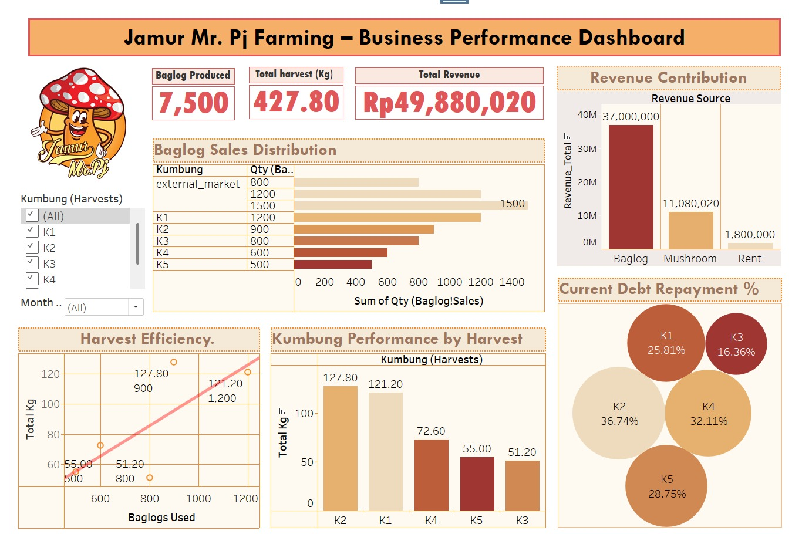

# Business Performance Dashboard – Jamur Mr. Pj Farming

**🔎 Overview**
This project presents a business performance dashboard for Jamur Mr. Pj (mushroom farming). The dataset used here is dummy data, but it is inspired by a real mushroom cultivation business model. The goal is to showcase data analysis and visualization skills by simulating real business cases. The dashboard helps to:
- Monitor production (baglogs & harvest).
- Track revenue sources.
- Evaluate kumbung (mushroom house) performance.
- Assess debt repayment progress.

🏢**Business Context**
This dataset is inspired by a real mushroom farming business model with 5 cultivation houses ("kumbung"), each managed by a different farmer.  
1. Financing model
  The company provides initial capital. Farmers repay debt through a revenue-sharing scheme: 50% of each harvest income is deducted until debt is cleared, then farmers receive full payment.  
2. Debt components:  
  - Kumbung rent: Rp200,000/month (starting from the first harvest month).  
  - Baglog purchase: Rp4,000 per baglog (internal price).  
3. Baglog production:  
  - Company produces baglogs at Rp2,000 cost.  
  - Sold internally to farmers (Rp4,000/baglog) and externally to third parties (Rp6,000/baglog).  
4. Mushroom sales:  
  - Farmers must sell mushrooms to the company at Rp23,000/kg.  
  - Company resells to resellers at Rp25,000/kg and to end customers at Rp28,000/kg.  
5. Revenue sources:  
  1. Rent income (kumbung rental).  
  2. Baglog sales margin.  
  3. Mushroom resale margin.  

**🔨 Data Analysis Workflow**
1. Data Preparation
- Compiled dummy dataset with structure reflecting real mushroom farming.
- Standardized key metrics: Kg for harvest, Rp for revenue.
2. Data Cleaning
- Checked missing values.
- Ensured consistency across financial and production data.
3. Calculated Fields
- Debt Repayment % = (Initial Debt – Remaining Debt) / Initial Debt.
- Total Revenue = Revenue of Baglog+Mushroom+Rent.
4. Data Visualization (Tableau Dashboard)
- KPIs: Baglog produced, total harvest (Kg), total revenue (Rp).
- Bar Chart: Baglog Sales Distribution. shows the comparison between baglogs sold internally (to kumbung growers) and externally (to outside buyers).
- Bar Chart: Revenue Contribution by source. breaks down the company’s revenue streams into three main sources: kumbung rental, baglog sales, and mushroom sales.
- Scatter Plot: Harvest Efficiency (Baglogs vs. Kg). illustrates the relationship between the number of baglogs used and the total mushroom harvest (kg), highlighting cultivation effectiveness.
- Bar Chart: Kumbung Performance by Harvest. compares the total mushroom yield across different kumbungs (cultivation rooms) to evaluate each grower’s performance.
- Bubble Chart: Current Debt Repayment %. visualizes the progress of debt repayment for each kumbung, based on the 50% revenue deduction system applied at every harvest.

**📊 Dashboard Preview**

**💡 Insights**
1. The largest revenue source comes from baglog sales (Rp37,000,000/74%), followed by mushroom sales (Rp11,080,020/22%), and rent (Rp1,800,000/4%).
2. This shows the business is still highly dependent on baglog distribution. There’s potential to grow mushroom sales for better revenue balance.
3. Among internal kumbung, K1 and K2 are the most active buyers, aligning with their stronger harvest results. while others (K5, K3) lag behind.
5. Scatter plot indicates a positive relationship between baglog usage and harvest yield.
6. However, not all kumbung are equally efficient. For example:
- K2 produced the highest harvest (127.80 Kg) from 900 baglogs.
- K3 produced only 51.20 Kg from 800 baglogs → lowest efficiency.
7. Clear performance gap indicates best practices from K2 and K1 should be replicated in other kumbung.
8. K2 (36.74%) and K4 (32.11%) have the highest capacity for debt repayment, reflecting stronger financial positions. While K3 (16.36%) is the weakest contributor, again signaling low productivity and financial output.

**🚀 Recommendations**
1. Scale up mushroom sales to reduce reliance on baglog distribution.
2. Adopt K2’s farming practices in other kumbung to improve overall efficiency.
3. Investigate low performance in K3 (possible issues: environment, maintenance, or labor).
4. Support low-performing kumbung with training/monitoring.
5. Improve debt repayment monitoring to ensure cash flow stability.

**🚀 How to Use**
1. Download the dataset
2. Open Tableau. Tableau Workbook https://public.tableau.com/views/Book3_17591393433420/Dashboard1?:language=en-US&:sid=&:redirect=auth&:display_count=n&:origin=viz_share_link
3. Reproduce calculated fields & visualizations following the workflow above.

**📌 Next Steps**
1. Expand dataset with real case records for deeper analysis.
2. Add time-series analysis for trend forecasting.
3. Build interactive dashboard with filters (month, kumbung, revenue type).

**Terminology**
- Baglog: Mushroom planting medium, usually made of sawdust in plastic with mushroom seeds inside.
- Kumbung: Mushroom house or cultivation room (K1-K5).
- Internal buyer: Cultivation managers who buy baglog from the company.
- External buyer: Third parties who purchase baglog outside the internal system.
- Reseller: Distributors who buy mushrooms in bulk at a lower price to resell.

